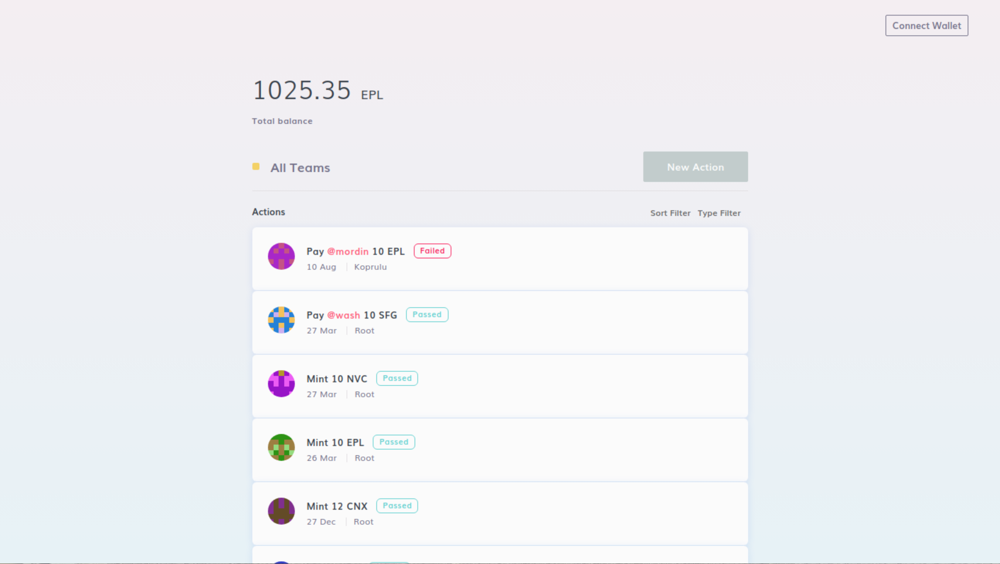
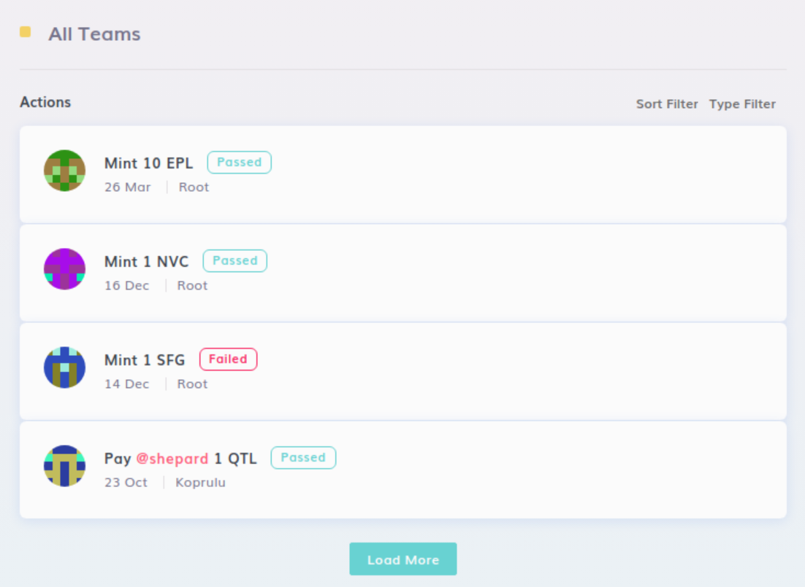
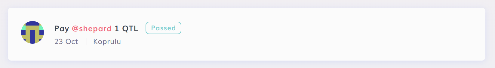
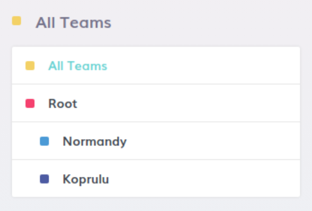
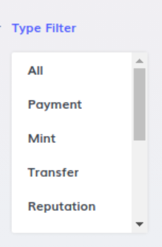
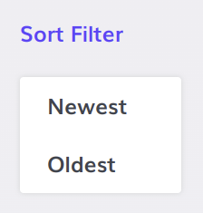
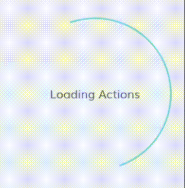
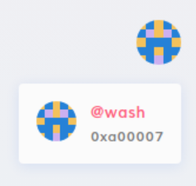

# QA Engineer Technical Challenge

This technical challenge is designed to assess your proficiency in testing web applications via automated means, as well as your ability to communicate and document your findings.

You will be required to write a test script that will test a simulated web3 aplication, ensuring you capture and account for as many flows and edge cases as possible.

The overall simulated application is a list of _"Actions"_ which are essentially a collection _(one or more)_ of blockchain events that have been groupped together. There are several types of Actions, each with their own specific properties, data and descriptions.

## Tech Stack

This app has been set up using the following tech stack, using our Legacy UI as well as parts of our Legacy codebase, and is a simulation of what your will be expected to run into during your day to day work:

- **Frontend:** `React` *(using `TypeScript`)*, `Apollo Client`, `CSS Modules`
- **Backend:** Backend is all mocked, no real backend is used
- **Testing Framework:** `Playwright` _(see below for possible alternatives)_

## Prerequisites

### Node Environment

To successfully set up and run this challenge, you'll need the following installed:
- `Node.js`: Version `20` [https://nodejs.org/](https://nodejs.org/).

We suggest using `nvm` to manage your Node.js versions [https://github.com/nvm-sh/nvm](https://github.com/nvm-sh/nvm).

## Browser Environment

This challenge is designed on, and it only expected to support the [Chrome Web Bbrowser](https://www.google.com/chrome/).

## Operating System

This challenge was built and tested on MacOS and Linux systems and it's expected to be run on those systems specifically.

We cannot guarantee that it will work on Windows systems, but if you still want to run it that way, we suggest using [WSL](https://learn.microsoft.com/en-us/windows/wsl/install) for virtualization.

## Starting the Project

- Clone the repository
- Install the dependencies: **`npm install`** _(make sure you are on the correct version of Node. If you are using `nvm`, you can run `nvm use` to switch to the correct version)_
- Start the project: **`npm start`**

## Accessing the Application

- Frontend: [http://localhost:3000](http://localhost:3000)

## Notes, Tips and Tricks

- Changes to the client will automatically reflect in your client *(hot reloading)*.
- The application is a simulation of a real-world application, so you can expect to find bugs, issues, edge cases as well as network connectivity problems.
- Wallet addresses, contract address and transaction hashes are all simulated, and while they still use the same hex string encoding, their format does not match a real world environment.
- While the [Playwright](https://github.com/microsoft/playwright) framework has already been set up for you, and it's the one we use internally, feel free use a different framework if you are more comfortable with it _(eg: Cypress, Selenium, etc)_.
- If at any point you run into issues setting up or running this repository, please reach out to us for help, as while some technical skills are required for this role, getting this working **is not part of the challenge**.

## The Challenge

The challenge requirements are listed below in detail, and it's expected that you will write test script(s) that will cover all the requirements.

### List
- Ensure all the list components are rendered as expected: list and list items, title, load more button, team filter, date sort, type filter
- Ensure the list renders the correct number of initial items: 10 items per page

### Individual Item
- Ensure list items have the expected elements: user avar, title, status, date, team
- Ensure the title correspons to the correct type

| Type | Library |
| --------| --------|
| `MINT` | `Mint <amount> <symbol>` |
| `PAYMENT` | `Pay <user> <amount> <symbol>` |
| `TRANSFER` | `Move <amount> <symbol> from <team> to <team>` |
| `REPUTATION` | `Awarded <user> with a <amount> points reputation award` |
| `PERMISSIONS` | `Assign the <comma-separated-roles> permissions in <team> to <user>` |
| `UPGRADE` | `Upgrade to version <version>` |
| `DETAILS` | `Details changed` |
| `ADDRESS` | `Address book was updated` |
| `TEAM` | `New team: <team>` |
| `GENERIC` | `Generic Action` |

### Filtering and Sorting
- Ensure the list is correctly sorted by date: ascending and descending
- Ensure the list is correctly filtered by type: only the items with the selected type are displayed
- Ensure the list is correctly filtered by team: only the items from the selected team are displayed
- Ensure all two filters plus the sort can work in combination

### Loading
- Ensure list loading renders the correct loader component
- Account for loading errors or failures
- Ensure the "Load More" button works as expected: loads more items, disappears when there are no more items to load

### Bonus Points
- Ensure the user popover component opens and closes as expected
- Ensure the user popover component displays the correct user information: user avatar, user name, user address
- Ensure the user avatar matches the one in the list item

## Expected Completion Time

This challenge is designed to be completed in `1` to `3` hours, but you are free to take as much time as you need, as this challenge is not time-boxed.

The timeframe above is an just estimate for your reference.

## Submitting

- Fork the repository and make your changes.
- Send the link to your repo _(either a public repo or a private one)_ via the internal [Otta](https://otta.com/) message thread you received this challenge in, alternatively you can send it to `raul@colony.io`.
- **DO NOT** submit your changes as a Pull Request to this repo, as that will expose your work to other candidates!
- As mentioned above, if you run into any issues submitting your work, please reach out to us for help, as while `git` familiarity is expected for this role, managing this submission **is not part of the challenge**.

## Evaluation Criteria

Your submission will be evaluated on the following:

- **Testing:** All testing tasks are properly completed and tests are not flaky
- **Documentation:** Clear test scripts and comments explaining your thought process and approach
- **Details:** Demonstrable attention to detail in capturing edge cases and flows
- **Bonus Points:** Testing components not listed above, optimizing testing, or innovative solutions to testing problems

## Support

If you encounter any issues or have questions about the challenge, please feel free to respond to the internal [Otta](https://otta.com/) message thread you received this challenge in, or reach out to `support@colony.io`.
